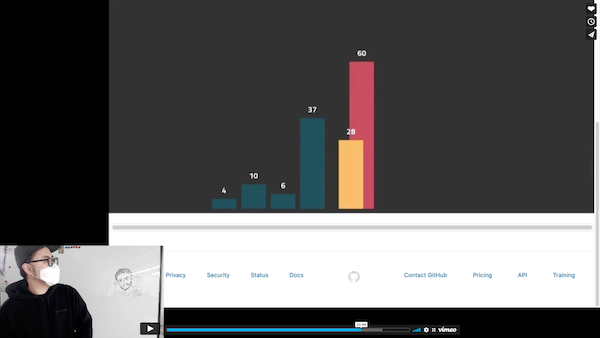

# Sorting Algorithms

정렬 알고리즘의 실행 순서를 시각적으로 표현해내는 과제입니다. 상세 내용은 아래 TODO 부분을 참고해주세요.

## Setup

Install dependencies

```sh
# Node.js 16 버전대 사용을 권장합니다.
npm install
```

## Development

```sh
npm start
# visit http://localhost:1234
```

- HTML 수정: `index.html`를 수정하세요.
- CSS 수정: `/assets/styles/index.less`를 수정하세요.
- Image 추가: `/assets/images` 디렉토리를 이용하세요.

## TODO

### STEP 1

- `app/bubbleSort.js` 내부에 `SWAP` 상수가 사용되지 않고 있습니다. 기존에 작성된 코드를 참고하여 `app/bubbleSort.js` 파일의 `bubbleSort` 함수 내용을 완성해주세요.
- `app/bubbleSort.js` 내부에 버블 정렬 알고리즘이 작성되어 있지만, 시간복잡도 측면에서 추가적인 최적화가 이루어질 수 있습니다. 개선 작업을 해주세요.

### STEP 2

그리고 아래의 조건이 충족/보존될 수 있도록 작업을 추가해야 합니다.

- 실행시킬 경우, 사용자가 선택한 정렬 로직이 어떤 순서로 요소들을 정렬시키는지 시각적으로 보여주어야 합니다.
- 사용자가 "숫자"들을 최소 5개에서 최대 10개까지 선택 혹은 입력할 수 있도록 유효성 검사를 진행해야 합니다.
- 숫자의 갯수가 충족되지 않았거나, 정렬 방식이 선택되지 않은 상황에서는 "실행"시킬 수 없어야 합니다.
- 숫자가 아닌 값은 받을 수 없어야 합니다.
- 중복된 값을 허용해야 합니다.
- 명시된 조건 이외에는 구현되지 않아도 무관합니다.

### STEP 3

- 위에서 작업한 버블정렬 시각화 로직을 참고하여 **삽입 정렬 알고리즘** 을 시각화 작업을 해주세요.

### STEP 4

시간적 여유가 된다면, 시각화 애니메이션은 본인이 원하는 방향으로 커스터마이징 해보시면 좋을것 같습니다. 기존에 작성되어 있는 틀을 잘 응용해서 구현하는 것도 좋지만, 더 나아가 애니메이션 효과 등을 본인이 원하는 방향으로 변화시켜보며 기존 코드를 수정해보는 등의 시도를 해보시면 더없이 좋을것 같습니다. 아래는 예전 기수 분들의 시각화 예시입니다.

[](https://vimeo.com/661700714/9f8e48eaf6)

## Reference

1. [Bubble Sort](https://en.wikipedia.org/wiki/Bubble_sort)
2. [Insertion Sort](https://en.wikipedia.org/wiki/Insertion_sort)
3. [Merge Sort](https://en.wikipedia.org/wiki/Merge_sort)
4. [Quick Sort](https://en.wikipedia.org/wiki/Quicksort)

## Note

- 과제를 수행하실 때 작성한 코드가 정상적으로 반영이 되지 않는 경우 아래를 참고해주세요.

  - ex. 수정한 값이 반영이 안될 때
  - ex. CSS 변경사항이 실시간으로 적용되지 않을 때

- 해결 방법 1. 크롬 인터넷 사용 기록 삭제 후 재시도
  - 크롬 브라우저 오른쪽 상단 세로 ... 버튼 - 설정 - 개인정보 및 보안 - 인터넷 사용 기록 삭제
- 해결 방법 2. 크롬 시크릿 창에서 재시도
  - 크롬 브라우저 오른쪽 상단 세로 ... 버튼 - 새 시크릿 창
